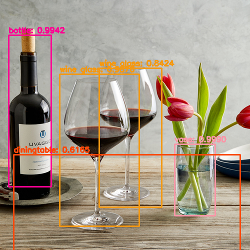
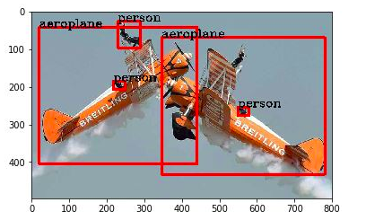

# Yolo-v2 Model
You Only Look Once Version-2

# Collaborator
Prayushi Mathur, Vraj Patel

This repository contains the files related to implementation of YOLO v2 model based on the paper of pjreddie darknet. The dataset used here is YOLO-coco. We have implemented this model on images and videos.

# Introduction
Object detection is one of the most important application of deep learning in real life. YOLO which stands for 'You Only Look Once' is a state-of-the-art method. This algorithm is extremely fast and can be used in real time multi object detection. The algorithm traces an image only once and gives the result accordingly. The results include the following:

- Bounding Boxes: These are a rectangular boxes which specify the location of the target. They are made by the x and y axis coordinates in the upper-left corner and the x and y axis coordinates in the lower-right corner of the rectangle.

-Name of Object: The name of the object detected by the bouding boxes are shown in the predicted result.

-Confidence Score: This is the score determining the proability of an object in the anchor box. When the confidence score of a detection that is supposed to detect a ground-truth is lower than the threshold, the detection counts as a false negative (FN). On the other hand, when the confidence score of a detection that is not supposed to detect anything is lower than the threshold, the detection counts as a true negative (TN). 

# Model Description
<table>
    <tr>
        <td>First Cell</td>
        <td>Second Cell</td>
    </tr>
    <tr>
        <td>First Cell, Second Row</td>
        <td>Second Cell, Second Row</td>
    </tr>
</table>

# Introduction Of Files Contained In This Repository
-yolo_v2.py - This python file contains the code of the model
-yolov2.weights - This file contains the weights used in the model.
-yolov2.cfg- This file contains the configuration of the model.
-images - This folder contains some sample images for testing.

# Steps To Run The Model
1.) Clone the repository.
2.) Open the folder and run the below command in the command prompt for object detection on image:
'python yolo_v2.py --image images/baggage_claim.jpg --yolo yolo-coco'

Open the folder and run the below command in the command prompt for object detection on video:
'python yolo_video.py --input videos/airport.mp4 --output output/airport_output.avi --yolo yolo-coco'

(Change the name of the image accordingly)

# Results

